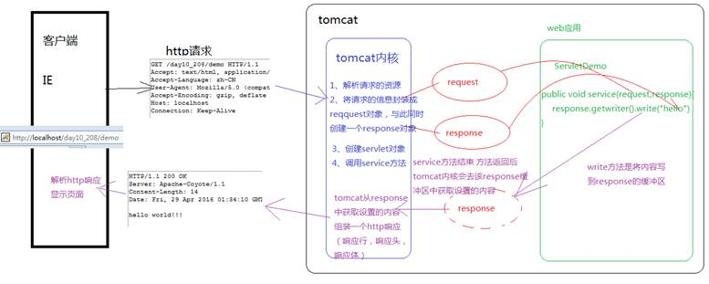

​    我们在创建Servlet时会覆盖service()方法，或doGet()/doPost(),这些方法都有两个参数，一个为代表请求的request和代表响应response。

​    service方法中的request的类型是ServletRequest，而doGet/doPost方法的request的类型是HttpServletRequest，HttpServletRequest是ServletRequest的子接口，功能和方法更加强大

**Request的运行流程**

**通过抓包工具抓取Http请求**

**通过request获得内容**

1. 通过request获得请求行

    获得客户端的请求方式：String getMethod()

    获得请求的资源：

    String getRequestURI() 

    StringBuffer getRequestURL() 

    String getContextPath() ---web应用的名称

    String getQueryString() ---- get提交url地址后的参数字符串

    username=zhangsan&password=123

    注意：request获得客户机（客户端）的一些信息

    request.getRemoteAddr() --- 获得访问的客户端IP地址

2. 通过request获得请求头

    long getDateHeader(String name)

    String getHeader(String name)

    Enumeration getHeaderNames()

    Enumeration getHeaders(String name)

    int getIntHeader(String name)

    referer头的作用：获得此访问的的来源做防盗

~~~java
获得请求头：
//1、获得指定的头
String header = request.getHeader("User-Agent");
System.out.println(header);
//2、获得所有的头的名称
Enumeration<String> headerNames = request.getHeaderNames();
while(headerNames.hasMoreElements()){
    String headerName = headerNames.nextElement();
    String headerValue = request.getHeader(headerName);
    System.out.println(headerName+":"+headerValue);
}
防盗链：
//对该新闻的来源的进行判断
String header = request.getHeader("referer");
if(header!=null&&header.startsWith("http://localhost")){
    //是从我自己的网站跳转过来的 可以看新闻
    response.setContentType("text/html;charset=UTF-8");
    response.getWriter().write("中国确实已经拿到100块金牌....");
}else{
    response.getWriter().write("你是盗链者，可耻！！");
}
~~~

​    

3. 通过request获得请求体

    请求体中的内容是通过post提交的请求参数，格式是：

    ​	username=zhangsan&password=123&hobby=football&hobby=basketball

    ​	key ---------------------- value

    ​	username        [zhangsan]

    ​	password        [123]

    ​	hobby          [football，basketball]

     

    以上面参数为例，通过一下方法获得请求参数：

    ​	String getParameter(String name) 

    ​	String[] getParameterValues(String name)

    ​	Enumeration getParameterNames()

    ​	Map<String,String[]> getParameterMap()

    

       注意：get请求方式的请求参数上述的方法一样可以获得

    

       解决post提交方式的乱码：

    ​		request.setCharacterEncoding("UTF-8");

       解决get提交的方式的乱码：

    ​      parameter = new String(parameter.getbytes("iso8859-1"),"utf-8");

~~~java
//1、获得单个表单值
String username = request.getParameter("username");
System.out.println(username);
String password = request.getParameter("password");
System.out.println(password);
//2、获得多个表单的值
String[] hobbys = request.getParameterValues("hobby");
for(String hobby:hobbys){
    System.out.println(hobby);
}
//3、获得所有的请求参数的名称
Enumeration<String> parameterNames = request.getParameterNames();
while(parameterNames.hasMoreElements()){
    System.out.println(parameterNames.nextElement());
}
System.out.println("------------------");
//4、获得所有的参数 参数封装到一个Map<String,String[]>
Map<String, String[]> parameterMap = request.getParameterMap();
for(Map.Entry<String, String[]> entry:parameterMap.entrySet()){
    System.out.println(entry.getKey());
    for(String str:entry.getValue()){
        System.out.println(str);
    }
    System.out.println("---------------------------");
}
~~~

**request的其他功能**

1. request是一个域对象

    request对象也是一个存储数据的区域对象，所以也具有如下方法：

    setAttribute(String name, Object o)

    getAttribute(String name)

    removeAttribute(String name)

​	   注意：request域的作用范围：一次请求中

 

2. request完成请求转发

    获得请求转发器----path是转发的地址

    RequestDispatcher getRequestDispatcher(String path)

    通过转发器对象转发

    requestDispathcer.forward(ServletRequest request, ServletResponse response)

    

3. 注意：ServletContext域与Request域的生命周期比较？

​			ServletContext：

​				创建：服务器启动

​				销毁：服务器关闭

​				域的作用范围：整个web应用

​			request：

​				创建：访问时创建request

​				销毁：响应结束request销毁

​				域的作用范围：一次请求中

 

4. 注意：转发与重定向的区别？
    * 重定向两次请求，转发一次请求
    * 重定向地址栏的地址变化，转发地址不变
    * 重新定向可以访问外部网站 转发只能访问内部资源
    * 转发的性能要优于重定向

 

5. 注意：客户端地址与服务器端地址的写法？

    客户端地址：（重定向）

    是客户端去访问服务器的地址，服务器外部的地址，特点：写上web应用名称

    服务器端地址：（转发）

    服务器内部资源的跳转的地址，特点：不需要写web应用的名称